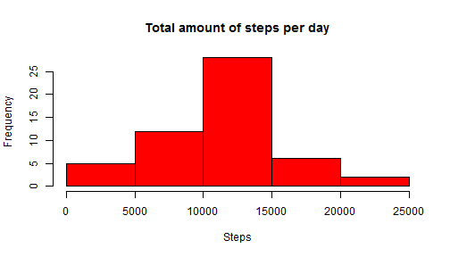
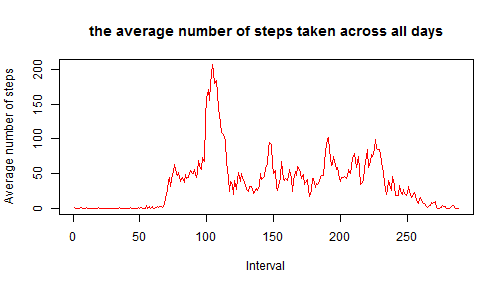
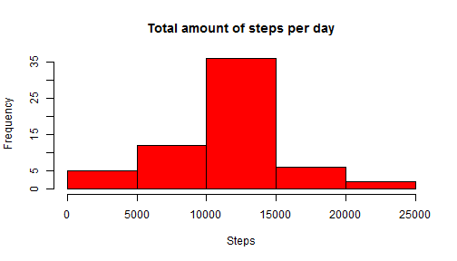
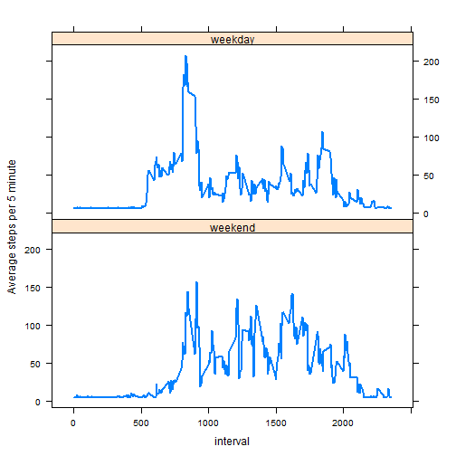

## Loadning and preprocessing the data


The following code downloads the file and transforms the data such that the data can be used in the analysis. 

We want to obtain data from the URL:

URL  = "https://d396qusza40orc.cloudfront.net/repdata%2Fdata%2Factivity.zip"

The following function downloads the data if it not exists in my working directory. 


```r
filedownload <- function(URL, fname){
    if(!file.exists(fname)){
        download.file(URL, destfile = fname)
    }
    fname    
}
```

This function transforms the data into the corresponding category and writes a new .csv file. If this file exists in the directory it simple reads the file using read.csv().


```r
data_init <- function(){
    cachefile <- "activity_transformed.csv"
    if(file.exists(cachefile)) {
            data <- read.csv(cachefile)
    }
    
    else {
        fname <- filedownload("https://d396qusza40orc.cloudfront.net/repdata%2Fdata%2Factivity.zip", "Factivity.zip")
        # Unzip file
        temp <- unz(fname, "activity.csv")
        data <- read.csv(temp, header = TRUE, sep = ",", na.strings = "NA")
    

        # Add a new variable
         data$date <- as.Date(data$date, "%Y-%m-%d")
        
        write.csv(data, cachefile)
    }
    data
}
```

The data is loaded by data_init()


```r
data <- data_init()
```

Remove observations containing NA values via na.exclude() function.


```r
df_activity <- na.exclude(data)
```

## Mean total number of steps taken per day

The following chunk makes a histogram of the total number of steps taken each day.

We need to aggregate the data, which can be done in the following way


```r
df_A_Sum <- aggregate(steps~date, data=df_activity, FUN=sum)
```


```r
hist(df_A_Sum$steps, 
     main="Total amount of steps per day", 
     xlab="Steps", 
     breaks=5,
     col="red"
)
```

 

The mean and the median can be calculated as


```r
mean <- mean(df_A_Sum$steps)

median <- median(df_A_Sum$steps)
```

And we obtain: 

* mean: 1.0766 &times; 10<sup>4</sup>

* median: 10765


## Average daily activity pattern

The following makes a time series plot (i.e. ``` type = "l" ```) of the 5-minute interval (x-axis) and the average number of steps taken, averaged across all days (y-axis)

The following chunk creates a new data frame containing the average number of steps taken, averaged across all days.

```r
intervalStepsAvg <- aggregate(df_activity$steps, list(as.factor(df_activity$interval)), FUN = "mean")

names(intervalStepsAvg) <- c("interval", "steps")
```

Note that


```r
dim(intervalStepsAvg)
```

```
## [1] 288   2
```

Thus, we realize that there are 288 five-minute periods in a day.

Next, we plot the the average number of steps.


```r
plot(intervalStepsAvg$steps,
    type = "l", 
    xlab = "Interval",
    ylab = "Average number of steps",
    main = "the average number of steps taken across all days",
    col  = "red"
)
```

 

The 5-minute interval averaged across all the days in the dataset, which contains the maximum number of steps is (note that the step below is the i'th interval)


```r
which.max(intervalStepsAvg$steps)
```

```
## [1] 104
```
which corresponds to the interval


```r
intervalStepsAvg$interval[104]
```

```
## [1] 835
## 288 Levels: 0 5 10 15 20 25 30 35 40 45 50 55 100 105 110 115 120 ... 2355
```

with maximum value


```r
max(intervalStepsAvg$steps)
```

```
## [1] 206.2
```


## Inputing missing values


The total number of missing values in the dataset (i.e. the total number of rows with NAs) is 


```r
Number_of_NA <- nrow(data) - sum(complete.cases(data))
```

Show a summary of the data 


```r
summary(data)
```

```
##        X             steps               date          interval   
##  Min.   :    1   Min.   :  0.0   2012-10-01:  288   Min.   :   0  
##  1st Qu.: 4393   1st Qu.:  0.0   2012-10-02:  288   1st Qu.: 589  
##  Median : 8784   Median :  0.0   2012-10-03:  288   Median :1178  
##  Mean   : 8784   Mean   : 37.4   2012-10-04:  288   Mean   :1178  
##  3rd Qu.:13176   3rd Qu.: 12.0   2012-10-05:  288   3rd Qu.:1766  
##  Max.   :17568   Max.   :806.0   2012-10-06:  288   Max.   :2355  
##                  NA's   :2304    (Other)   :15840
```

Thus, only the "steps" variable contains NA observations. 

Devise a strategy for filling in all of the missing values in the dataset. The strategy does not need to be sophisticated. For example, you could use the mean/median for that day, or the mean for that 5-minute interval, etc.

I suggests to replace NA's with the mean.

We now create a new dataset that is equal to the original dataset but with the missing data filled in.


```r
DATA_IMPUTED <- data

mean_steps <- mean(data$steps, na.rm = TRUE)

indexMissingSteps <- which(is.na(DATA_IMPUTED$steps))

DATA_IMPUTED$steps[indexMissingSteps] <- mean_steps
```

Get at summary 


```r
summary(DATA_IMPUTED)
```

```
##        X             steps               date          interval   
##  Min.   :    1   Min.   :  0.0   2012-10-01:  288   Min.   :   0  
##  1st Qu.: 4393   1st Qu.:  0.0   2012-10-02:  288   1st Qu.: 589  
##  Median : 8784   Median :  0.0   2012-10-03:  288   Median :1178  
##  Mean   : 8784   Mean   : 37.4   2012-10-04:  288   Mean   :1178  
##  3rd Qu.:13176   3rd Qu.: 37.4   2012-10-05:  288   3rd Qu.:1766  
##  Max.   :17568   Max.   :806.0   2012-10-06:  288   Max.   :2355  
##                                  (Other)   :15840
```


Make a histogram of the total number of steps taken each day and Calculate and report the mean and median total number of steps taken per day. Do these values differ from the estimates from the first part of the assignment? What is the impact of imputing missing data on the estimates of the total daily number of steps?


```r
df_A_Sum_Imputed <- aggregate(steps~date, data=DATA_IMPUTED, FUN=sum)
```


```r
hist(df_A_Sum_Imputed$steps, 
     main="Total amount of steps per day", 
     xlab="Steps", 
     breaks=5,
     col="red"
)
```

 

The mean and the median can be calculated as


```r
mean <- mean(df_A_Sum_Imputed$steps)

median <- median(df_A_Sum_Imputed$steps)
```

And we obtain: 

* mean: 1.0766 &times; 10<sup>4</sup>

* median: 1.0766 &times; 10<sup>4</sup>

We see a very large difference in the mean and median. 

## Differences in activity patterns between weekdays and weekends


Create a new factor variable in the dataset with two levels - "weekday" and "weekend" indicating whether a given date is a weekday or weekend day.


```r
library(timeDate)
```

```
## Warning: package 'timeDate' was built under R version 3.1.1
```

```r
df <- cbind(DATA_IMPUTED, weekday  =  factor(isWeekday(data$date, wday = 1:5), labels = c("weekend", "weekday")))
```

Take the mean


```r
intervalStepsAvgByType <- aggregate(df$steps, list(df$interval, 
    df$weekday), "mean")

colnames(intervalStepsAvgByType) <- c("interval", "weekdays", "steps")
```

The following chunk makes a panel plot containing a time series plot (i.e. ```type = "l"````) of the 5 minute interval (x-axis) and the average number of steps taken, averaged across all weekday days or weekend days (y-axis). 


```r
library("lattice")

xyplot(intervalStepsAvgByType$steps ~ intervalStepsAvgByType$interval | intervalStepsAvgByType$weekdays, type = "l", lwd = 2, layout = c(1, 2), xlab = "interval", ylab = "Average steps per 5 minute")
```

 
